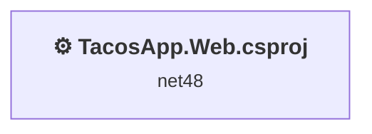
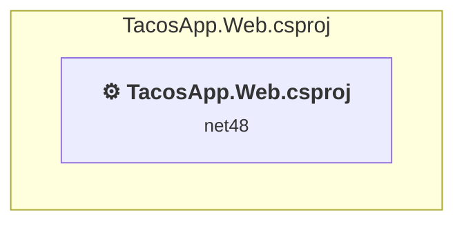

# Projects and dependencies analysis

This document provides a comprehensive overview of the projects and their dependencies in the context of upgrading to .NETCoreApp,Version=v10.0.

## Table of Contents

- [Executive Summary](#executive-Summary)
  - [Highlevel Metrics](#highlevel-metrics)
  - [Projects Compatibility](#projects-compatibility)
  - [Package Compatibility](#package-compatibility)
  - [API Compatibility](#api-compatibility)
  - [Binding Redirect Configuration](#binding-redirect-configuration)
- [Aggregate NuGet packages details](#aggregate-nuget-packages-details)
- [Top API Migration Challenges](#top-api-migration-challenges)
  - [Technologies and Features](#technologies-and-features)
  - [Most Frequent API Issues](#most-frequent-api-issues)
- [Projects Relationship Graph](#projects-relationship-graph)
- [Project Details](#project-details)

  - [TacosApp.Web.csproj](#tacosappwebcsproj)

## Executive Summary

### Highlevel Metrics

| Metric | Count | Status |
| :--- | :---: | :--- |
| Total Projects | 1 | All require upgrade |
| Total NuGet Packages | 0 | All compatible |
| Total Code Files | 39 |  |
| Total Code Files with Incidents | 20 |  |
| Total Lines of Code | 2017 |  |
| Total Number of Issues | 321 |  |
| Estimated LOC to modify | 282+ | at least 14.0% of codebase |

### Projects Compatibility

| Project | Target Framework | Difficulty | Package Issues | API Issues | Binding Issues | Est. LOC Impact | Description |
| :--- | :---: | :---: | :---: | :---: | :---: | :---: | :--- |
| [TacosApp.Web.csproj](#tacosappwebcsproj) | net48 | 🔴 High | 22 | 282 | 3 | 282+ | Wap, Sdk Style = False |

### Package Compatibility

| Status | Count | Percentage |
| :--- | :---: | :---: |
| ✅ Compatible | 0 | 0.0% |
| ⚠️ Incompatible | 0 | 0.0% |
| 🔄 Upgrade Recommended | 0 | 0.0% |
| ***Total NuGet Packages*** | ***0*** | ***100%*** |

### API Compatibility

| Category | Count | Impact |
| :--- | :---: | :--- |
| 🔴 Binary Incompatible | 249 | High - Require code changes |
| 🟡 Source Incompatible | 33 | Medium - Needs re-compilation and potential conflicting API error fixing |
| 🔵 Behavioral change | 0 | Low - Behavioral changes that may require testing at runtime |
| ✅ Compatible | 1271 |  |
| ***Total APIs Analyzed*** | ***1553*** |  |

### Binding Redirect Configuration

| Severity | Count | Description |
| :--- | :---: | :--- |
| 🔴Mandatory | 2 | Must be fixed to avoid runtime failures |
| 🟡Potential | 1 | May cause issues in certain scenarios |
| ***Total Binding Issues*** | ***3*** | ***Across 1 project(s)*** |

## Aggregate NuGet packages details

| Package | Current Version | Suggested Version | Projects | Description |
| :--- | :---: | :---: | :--- | :--- |

## Top API Migration Challenges

### Technologies and Features

| Technology | Issues | Percentage | Migration Path |
| :--- | :---: | :---: | :--- |
| ASP.NET Framework (System.Web) | 246 | 87.2% | Legacy ASP.NET Framework APIs for web applications (System.Web.*) that don't exist in ASP.NET Core due to architectural differences. ASP.NET Core represents a complete redesign of the web framework. Migrate to ASP.NET Core equivalents or consider System.Web.Adapters package for compatibility. |
| Legacy Configuration System | 4 | 1.4% | Legacy XML-based configuration system (app.config/web.config) that has been replaced by a more flexible configuration model in .NET Core. The old system was rigid and XML-based. Migrate to Microsoft.Extensions.Configuration with JSON/environment variables; use System.Configuration.ConfigurationManager NuGet package as interim bridge if needed. |

### Most Frequent API Issues

| API | Count | Percentage | Category |
| :--- | :---: | :---: | :--- |
| T:System.Web.HttpSessionStateBase | 13 | 4.6% | Source Incompatible |
| T:System.Web.Mvc.ActionResult | 8 | 2.8% | Binary Incompatible |
| T:System.Web.Mvc.ViewResult | 8 | 2.8% | Binary Incompatible |
| T:System.Web.Mvc.RedirectToRouteResult | 8 | 2.8% | Binary Incompatible |
| M:System.Web.Mvc.Controller.#ctor | 6 | 2.1% | Binary Incompatible |
| T:System.Web.Mvc.JsonResult | 6 | 2.1% | Binary Incompatible |
| T:System.Web.Optimization.Bundle | 6 | 2.1% | Binary Incompatible |
| M:System.Web.Optimization.BundleCollection.Add(System.Web.Optimization.Bundle) | 6 | 2.1% | Binary Incompatible |
| P:System.Web.HttpSessionStateBase.Item(System.String) | 5 | 1.8% | Source Incompatible |
| P:System.Web.Mvc.ControllerBase.ViewBag | 5 | 1.8% | Binary Incompatible |
| M:System.Web.Mvc.ValidateAntiForgeryTokenAttribute.#ctor | 5 | 1.8% | Binary Incompatible |
| T:System.Web.Mvc.ValidateAntiForgeryTokenAttribute | 5 | 1.8% | Binary Incompatible |
| M:System.Web.Mvc.HttpPostAttribute.#ctor | 5 | 1.8% | Binary Incompatible |
| T:System.Web.Mvc.HttpPostAttribute | 5 | 1.8% | Binary Incompatible |
| P:System.Web.Mvc.Controller.Session | 5 | 1.8% | Binary Incompatible |
| M:System.Web.Mvc.Controller.RedirectToAction(System.String) | 5 | 1.8% | Binary Incompatible |
| M:System.Web.Mvc.Controller.View(System.Object) | 5 | 1.8% | Binary Incompatible |
| T:System.Web.Optimization.ScriptBundle | 5 | 1.8% | Binary Incompatible |
| M:System.Web.Optimization.ScriptBundle.#ctor(System.String) | 5 | 1.8% | Binary Incompatible |
| M:System.Web.Optimization.Bundle.Include(System.String,System.Web.Optimization.IItemTransform[]) | 5 | 1.8% | Binary Incompatible |
| P:System.Web.Http.Controllers.HttpActionContext.Request | 4 | 1.4% | Binary Incompatible |
| T:System.Net.Http.HttpRequestMessageExtensions | 3 | 1.1% | Source Incompatible |
| M:System.Net.Http.HttpRequestMessageExtensions.CreateErrorResponse(System.Net.Http.HttpRequestMessage,System.Net.HttpStatusCode,System.String) | 3 | 1.1% | Binary Incompatible |
| P:System.Web.Http.Controllers.HttpActionContext.Response | 3 | 1.1% | Binary Incompatible |
| M:System.Web.Mvc.Controller.Dispose(System.Boolean) | 3 | 1.1% | Binary Incompatible |
| T:System.Web.Mvc.Controller | 3 | 1.1% | Binary Incompatible |
| M:System.Web.Mvc.Controller.Json(System.Object) | 3 | 1.1% | Binary Incompatible |
| T:System.Web.Http.IHttpActionResult | 3 | 1.1% | Binary Incompatible |
| M:System.Web.Http.RouteAttribute.#ctor(System.String) | 3 | 1.1% | Binary Incompatible |
| T:System.Web.Http.RouteAttribute | 3 | 1.1% | Binary Incompatible |
| T:System.Web.Mvc.ViewEngines | 3 | 1.1% | Binary Incompatible |
| T:System.Web.Mvc.ViewEngineCollection | 3 | 1.1% | Binary Incompatible |
| P:System.Web.Mvc.ViewEngines.Engines | 3 | 1.1% | Binary Incompatible |
| T:System.Web.Http.RouteParameter | 3 | 1.1% | Binary Incompatible |
| T:System.Web.Mvc.UrlParameter | 3 | 1.1% | Binary Incompatible |
| M:System.Web.HttpSessionStateBase.Remove(System.String) | 2 | 0.7% | Source Incompatible |
| T:Microsoft.AspNet.SignalR.Hubs.HubCallerContext | 2 | 0.7% | Binary Incompatible |
| P:Microsoft.AspNet.SignalR.Hubs.HubBase.Context | 2 | 0.7% | Binary Incompatible |
| P:Microsoft.AspNet.SignalR.Hubs.HubCallerContext.ConnectionId | 2 | 0.7% | Binary Incompatible |
| T:Microsoft.AspNet.SignalR.IGroupManager | 2 | 0.7% | Binary Incompatible |
| P:Microsoft.AspNet.SignalR.Hubs.HubBase.Groups | 2 | 0.7% | Binary Incompatible |
| T:System.Configuration.ConfigurationManager | 2 | 0.7% | Source Incompatible |
| P:System.Configuration.ConfigurationManager.AppSettings | 2 | 0.7% | Source Incompatible |
| M:System.Web.Mvc.Controller.View | 2 | 0.7% | Binary Incompatible |
| M:System.Web.Mvc.Controller.RedirectToAction(System.String,System.String) | 2 | 0.7% | Binary Incompatible |
| T:System.Web.Http.Results.NotFoundResult | 2 | 0.7% | Binary Incompatible |
| M:System.Web.Http.ApiController.NotFound | 2 | 0.7% | Binary Incompatible |
| T:System.Web.Http.Results.BadRequestErrorMessageResult | 2 | 0.7% | Binary Incompatible |
| M:System.Web.Http.ApiController.BadRequest(System.String) | 2 | 0.7% | Binary Incompatible |
| M:System.Web.Http.HttpGetAttribute.#ctor | 2 | 0.7% | Binary Incompatible |

## Projects Relationship Graph

Legend:
📦 SDK-style project
⚙️ Classic project

## Project Details

### TacosApp.Web.csproj

#### Project Info

- **Current Target Framework:** net48
- **Proposed Target Framework:** net10.0
- **SDK-style**: False
- **Project Kind:** Wap
- **Dependencies**: 0
- **Dependants**: 0
- **Number of Files**: 79
- **Number of Files with Incidents**: 20
- **Lines of Code**: 2017
- **Estimated LOC to modify**: 282+ (at least 14.0% of the project)

#### Dependency Graph

Legend:
📦 SDK-style project
⚙️ Classic project

### API Compatibility

| Category | Count | Impact |
| :--- | :---: | :--- |
| 🔴 Binary Incompatible | 249 | High - Require code changes |
| 🟡 Source Incompatible | 33 | Medium - Needs re-compilation and potential conflicting API error fixing |
| 🔵 Behavioral change | 0 | Low - Behavioral changes that may require testing at runtime |
| ✅ Compatible | 1271 |  |
| ***Total APIs Analyzed*** | ***1553*** |  |

#### Binding Redirect Configuration

| Rule | Severity | Details | Recommendation |
| :--- | :---: | :--- | :--- |
| Manual redirect conflicts with auto-generated version | 🔴Mandatory | Manual redirect for Newtonsoft.Json targets 13.0.0.0 but auto-generation would target 13.0.3 (MSB3836 conflict) | Remove the conflicting manual binding redirect or disable auto-generation. |
| Manual redirect conflicts with auto-generated version | 🔴Mandatory | Manual redirect for WebGrease targets 1.6.5135.21930 but auto-generation would target 1.6.0 (MSB3836 conflict) | Remove the conflicting manual binding redirect or disable auto-generation. |
| Binding redirect forces version downgrade | 🟡Potential | Binding redirect for Newtonsoft.Json targets 13.0.0.0 but package provides 13.0.3 | Update the binding redirect newVersion to match the version provided by the NuGet package. |

#### Project Technologies and Features

| Technology | Issues | Percentage | Migration Path |
| :--- | :---: | :---: | :--- |
| Legacy Configuration System | 4 | 1.4% | Legacy XML-based configuration system (app.config/web.config) that has been replaced by a more flexible configuration model in .NET Core. The old system was rigid and XML-based. Migrate to Microsoft.Extensions.Configuration with JSON/environment variables; use System.Configuration.ConfigurationManager NuGet package as interim bridge if needed. |
| ASP.NET Framework (System.Web) | 246 | 87.2% | Legacy ASP.NET Framework APIs for web applications (System.Web.*) that don't exist in ASP.NET Core due to architectural differences. ASP.NET Core represents a complete redesign of the web framework. Migrate to ASP.NET Core equivalents or consider System.Web.Adapters package for compatibility. |

